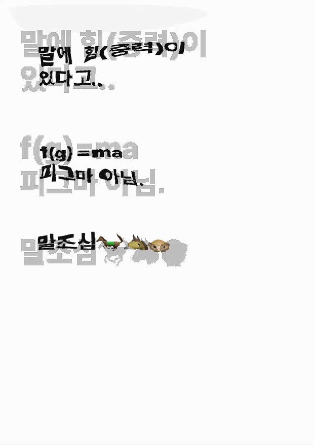
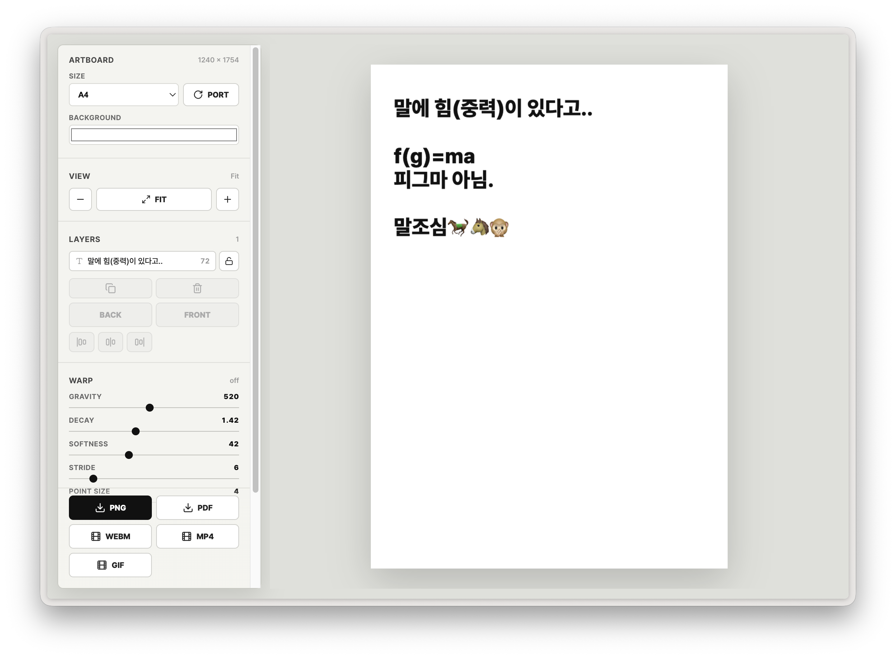
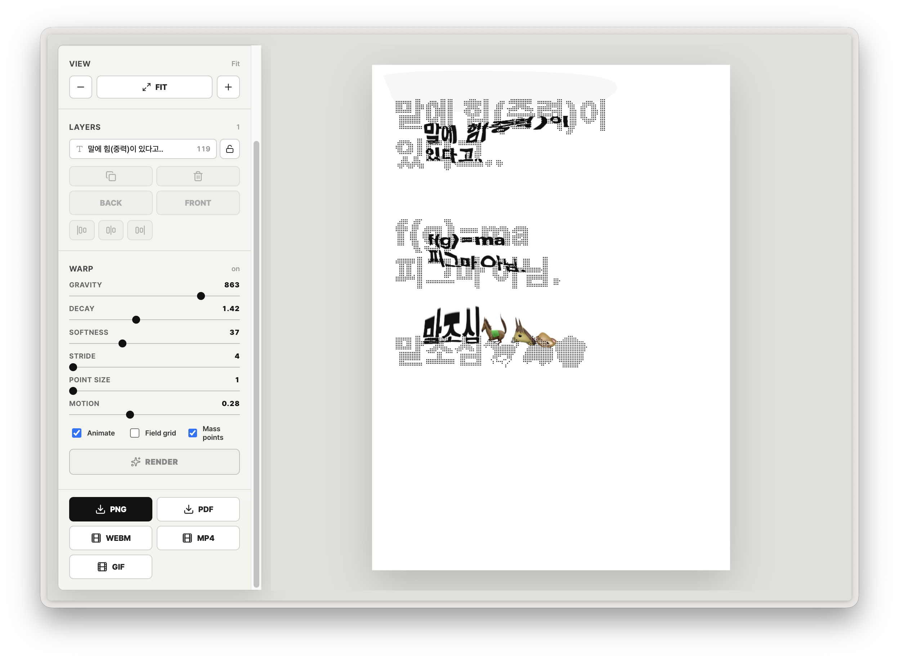

# f(g)=ma 포스터 제너레이터

> 텍스트를 질량으로, 레이아웃을 힘장으로 다루는 실험적 그래픽 저작 시스템

**f(g)=ma**는 텍스트를 입력하고, 밀도와 중력처럼 작동하는 규칙을 조절해 포스터를 만드는 생성형 그래픽 도구입니다.

일반적인 편집 툴처럼 요소를 하나씩 배치하는 대신, 텍스트의 크기, 굵기, 위치, 색, 왜곡 강도 같은 조건을 바꾸며 다양한 포스터 결과를 탐색할 수 있습니다. 한국어와 영어 텍스트를 함께 다룰 수 있고, 정적인 이미지뿐 아니라 움직이는 포스터도 만들 수 있습니다.

## 미리보기

### 움직이는 포스터 예시



### 기본 화면



### 효과 적용 화면



## 무엇을 할 수 있나요?

- 여러 개의 텍스트 레이어를 추가하고 편집할 수 있습니다.
- 한국어와 영어 폰트를 선택할 수 있습니다.
- 글자 크기, 굵기, 색상, 회전, 위치를 조절할 수 있습니다.
- 배경색과 아트보드 크기, 방향을 설정할 수 있습니다.
- 텍스트 밀도를 바탕으로 질량점과 격자를 만들 수 있습니다.
- 중력처럼 보이는 왜곡 효과를 적용할 수 있습니다.
- PNG, PDF, WEBM, MP4, GIF 형식으로 결과물을 내보낼 수 있습니다.

## 무엇이 다른가요?

대부분의 포스터 제작 도구는 텍스트 박스와 이미지를 직접 배치하는 방식으로 작동합니다. **f(g)=ma**는 텍스트를 화면 위의 오브젝트로만 보지 않고, 밀도와 질량을 만드는 입력값으로 다룹니다.

사용자가 입력한 문자는 캔버스 위에서 질량점으로 변환되고, 이 질량점은 포스터 표면을 밀고 당기는 힘처럼 작동합니다. 그래서 결과물은 하나의 고정된 레이아웃이 아니라, 텍스트의 밀도, 위치, 굵기, 왜곡 규칙이 서로 반응하며 만들어지는 그래픽 필드에 가깝습니다.

이 프로젝트의 목적은 포스터를 자동으로 대신 만들어주는 것이 아니라, 디자이너가 결과가 생성되는 조건과 규칙을 직접 설계하도록 돕는 것입니다.

## 빠른 시작

### macOS에서 실행하기

1. Node.js 18 이상이 설치되어 있지 않다면 [Node.js 공식 사이트](https://nodejs.org/)에서 설치합니다.
2. 프로젝트 폴더에서 `Start fgma.command` 파일을 더블클릭합니다.
3. 처음 실행할 때 필요한 패키지가 자동으로 설치됩니다.
4. 브라우저가 열리면 포스터 제너레이터를 사용할 수 있습니다.

macOS에서 파일 실행을 차단하면 `Start fgma.command`를 우클릭한 뒤 **열기**를 선택하고, 경고창에서 다시 **열기**를 누르세요. 한 번 허용하면 이후에는 더블클릭으로 실행됩니다.

### Windows에서 실행하기

1. Node.js 18 이상이 설치되어 있지 않다면 [Node.js 공식 사이트](https://nodejs.org/)에서 설치합니다.
2. 프로젝트 폴더에서 `Start fgma.bat` 파일을 더블클릭합니다.
3. 처음 실행할 때 필요한 패키지가 자동으로 설치됩니다.
4. 브라우저가 열리면 포스터 제너레이터를 사용할 수 있습니다.
5. 사용하는 동안 검은 명령 프롬프트 창을 닫지 마세요. 창을 닫으면 앱도 함께 종료됩니다.

Windows SmartScreen이 실행을 막으면 **추가 정보**를 누른 뒤 **실행**을 선택하세요.

### 터미널에서 직접 실행하기

프로젝트 폴더에서 아래 명령어를 실행합니다.

```bash
npm install
npm run dev
```

터미널에 표시되는 로컬 주소를 브라우저에서 엽니다. 보통 아래 주소로 실행됩니다.

```bash
http://localhost:5173
```

## 브라우저 호환성

기본 편집과 PNG/PDF 내보내기는 대부분의 최신 브라우저에서 사용할 수 있습니다. MP4, WEBM, GIF 같은 움직이는 포스터 내보내기는 브라우저의 영상 인코딩 지원 여부에 따라 동작이 다를 수 있습니다.

가장 안정적인 사용을 위해서는 최신 버전의 Chrome 또는 Edge를 권장합니다. Safari와 Firefox에서도 편집 기능은 사용할 수 있지만, 일부 영상 내보내기 기능은 제한될 수 있습니다.

## 기본 사용 흐름

1. 앱을 실행합니다.
2. 아트보드 크기와 배경색을 정합니다.
3. 텍스트 레이어를 추가합니다.
4. 글자 크기, 굵기, 색상, 위치, 회전을 조절합니다.
5. 필요하면 그리드나 질량점을 켜서 구조를 확인합니다.
6. 왜곡 강도, 감쇠, 포인트 간격, 움직임 값을 조절합니다.
7. 원하는 결과가 나올 때까지 설정을 바꿔봅니다.
8. PNG, PDF, WEBM, MP4, GIF 중 필요한 형식으로 내보냅니다.

## 주요 개념

프로젝트 이름 **f(g)=ma**는 물리 공식 `F = ma`에서 출발했습니다.

여기서 `g`는 **graphic**, **grid**, **gravity**, **generator**로 읽을 수 있습니다. 이 도구에서 텍스트는 단순히 읽히는 문자가 아니라, 포스터의 밀도를 만들고 화면을 움직이는 힘처럼 작동합니다.

이 프로젝트는 디자이너의 역할을 없애는 자동 생성기가 아닙니다. 오히려 디자이너가 직접 모든 요소를 배치하는 방식에서 벗어나, 결과가 만들어지는 규칙과 변수를 설계하도록 돕는 도구입니다.

## 개발 정보

- React
- Vite
- TypeScript
- WebGL
- HTML Canvas
- jsPDF
- gifenc
- mp4-muxer

## English Summary

**f(g)=ma** is a generative poster-making tool based on typography, density, and gravity-like distortion rules.

Instead of manually placing every object, the user adjusts visual parameters and system rules. Text becomes a graphic input that creates density, mass points, and motion. The tool supports Korean and English typography, static poster export, and animated poster export.

To run the project, install Node.js 18 or higher, then use `Start fgma.command` on macOS, `Start fgma.bat` on Windows, or run:

```bash
npm install
npm run dev
```

## License

This project is licensed under the MIT License. See [LICENSE](LICENSE) for details.
