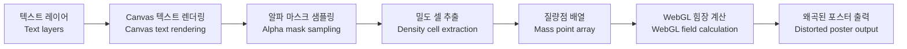

# f(g)=ma 작동 원리 / How It Works

이 문서는 **f(g)=ma**가 텍스트를 질량점으로 변환하고, 그 질량점을 이용해 포스터 표면을 왜곡하는 과정을 설명합니다.

This document explains how **f(g)=ma** converts text into mass points and uses those points to distort the poster surface.

## 전체 흐름 / Overview



## 1. 텍스트 레이어 / Text Layers

각 텍스트 레이어는 사용자가 조정한 시각 정보를 담고 있습니다.

Each text layer stores the visual properties adjusted by the user.

- 텍스트 내용 / Text content
- 위치와 너비 / Position and width
- 폰트, 크기, 굵기, 줄간격, 자간 / Font, size, weight, line height, and letter spacing
- 색상, 투명도, 정렬, 회전, 잠금 상태 / Color, opacity, alignment, rotation, and lock state

이 값들은 `TextLayer` 타입으로 관리되고, 앱의 UI에서 편집됩니다.

These values are managed as the `TextLayer` type and edited through the app UI.

## 2. Canvas 텍스트 렌더링 / Canvas Text Rendering

WebGL 왜곡을 적용하기 전에 텍스트는 `src/rendering/posterTexture.ts`에서 오프스크린 2D 캔버스에 먼저 그려집니다.

Before WebGL distortion is applied, text is first rendered to an offscreen 2D canvas in `src/rendering/posterTexture.ts`.

렌더러는 각 레이어를 배치하고, 레이어 너비에 맞게 줄바꿈을 처리하며, 한국어와 영문 폰트의 측정/출력을 함께 다룹니다. 이 과정에서 두 가지 캔버스가 만들어집니다.

The renderer positions each layer, wraps text according to the layer width, and handles measurement and output for both Korean and English fonts. This process creates two canvases.

- 화면에 보이는 포스터 표면으로 쓰이는 컬러 텍스처 / A color texture used as the visible poster surface
- 질량점 추출에만 쓰이는 흰색 알파 마스크 / A white alpha mask used only for mass point extraction

## 3. 알파 마스크 샘플링 / Alpha Mask Sampling

알파 마스크는 일정한 크기의 그리드 셀 단위로 샘플링됩니다. 각 셀은 내부 픽셀들의 알파값을 평균 내어 밀도를 계산합니다.

The alpha mask is sampled in grid cells of a fixed size. Each cell calculates density by averaging the alpha values of its internal pixels.

평균 밀도가 `MASS_DENSITY_THRESHOLD`보다 높으면 그 셀은 질량 후보가 됩니다. 즉, 글자가 실제로 차지하는 불투명한 영역은 힘을 만드는 지점이 되고, 비어 있는 배경은 무시됩니다.

If the average density is higher than `MASS_DENSITY_THRESHOLD`, the cell becomes a mass candidate. In other words, opaque areas occupied by text become force-generating points, while empty background areas are ignored.

핵심 변환은 다음과 같습니다.

The core transformation is:

```txt
보이는 텍스트 -> 픽셀 밀도 -> 질량점
Visible text -> Pixel density -> Mass points
```

## 4. 질량점 축약 / Mass Point Reduction

현재 구현은 WebGL1 uniform 배열을 사용합니다. WebGL1에서는 셰이더에 넘길 수 있는 uniform 배열 크기가 컴파일 시점에 정해져야 하므로, 무제한의 질량점을 보낼 수 없습니다.

The current implementation uses WebGL1 uniform arrays. In WebGL1, the size of a uniform array passed to a shader must be fixed at compile time, so the system cannot send an unlimited number of mass points.

기본 상한은 `src/rendering/massConfig.ts`의 `MAX_SHADER_MASSES`에 정의되어 있습니다. 또한 렌더러는 현재 GPU의 fragment uniform 용량을 확인해 실제 사용 가능한 질량점 수를 다시 계산합니다.

The default limit is defined as `MAX_SHADER_MASSES` in `src/rendering/massConfig.ts`. The renderer also checks the current GPU's fragment uniform capacity and recalculates the number of mass points it can actually use.

텍스트가 너무 많은 질량 후보를 만들면, 가까운 셀들을 더 큰 셀로 묶어 축약합니다. 이렇게 하면 후보 목록의 뒤쪽을 단순히 잘라내는 대신, 전체적인 밀도 구조를 유지할 수 있습니다.

If the text creates too many mass candidates, nearby cells are folded into larger cells. This preserves the overall density structure instead of simply cutting off the end of the candidate list.

각 질량점은 세 개의 숫자로 저장됩니다.

Each mass point is stored as three numbers.

```txt
x, y, mass
```

## 5. WebGL 힘장 계산 / WebGL Field Calculation

WebGL fragment shader는 포스터 텍스처와 질량점 배열을 받습니다.

The WebGL fragment shader receives the poster texture and the mass point array.

각 화면 픽셀에 대해 셰이더는 활성 질량점들을 순회하며 변위 벡터를 계산합니다. 이 힘은 사용자가 조절하는 값에 의해 달라집니다.

For each screen pixel, the shader loops through the active mass points and calculates a displacement vector. This force changes according to user-controlled values.

- `strength`: 질량점이 포스터 표면을 끌어당기는 힘 / How strongly mass points pull the poster surface
- `decay`: 거리에 따라 힘이 줄어드는 정도 / How quickly the force fades with distance
- `epsilon`: 질량점 중심부의 부드러움 / The softness around the center of each mass point
- `motionAmount`: 애니메이션 펄스의 크기 / The amount of animated pulse

셰이더는 원래 위치가 아니라 변위가 적용된 좌표에서 포스터 텍스처를 샘플링합니다. 이 과정에서 텍스트 밀도에 의해 포스터 표면이 휘어지는 효과가 만들어집니다.

The shader samples the poster texture from displaced coordinates rather than the original position. This creates the effect of the poster surface bending according to text density.

## 현재 한계 / Current Limitations

현재 구현은 브라우저 호환성과 배포의 단순성을 위해 WebGL1 uniform 배열을 사용합니다. 이 방식은 안정적이지만 질량점 수에 상한이 있습니다.

The current implementation uses WebGL1 uniform arrays for browser compatibility and simpler deployment. This approach is stable, but it limits the number of mass points.

향후 WebGL2 기반으로 전환하면 질량 데이터를 texture buffer나 유사한 구조로 넘겨 더 크고 동적인 힘장을 만들 수 있습니다.

A future WebGL2 version could pass mass data through a texture buffer or similar structure, allowing larger and more dynamic force fields.
